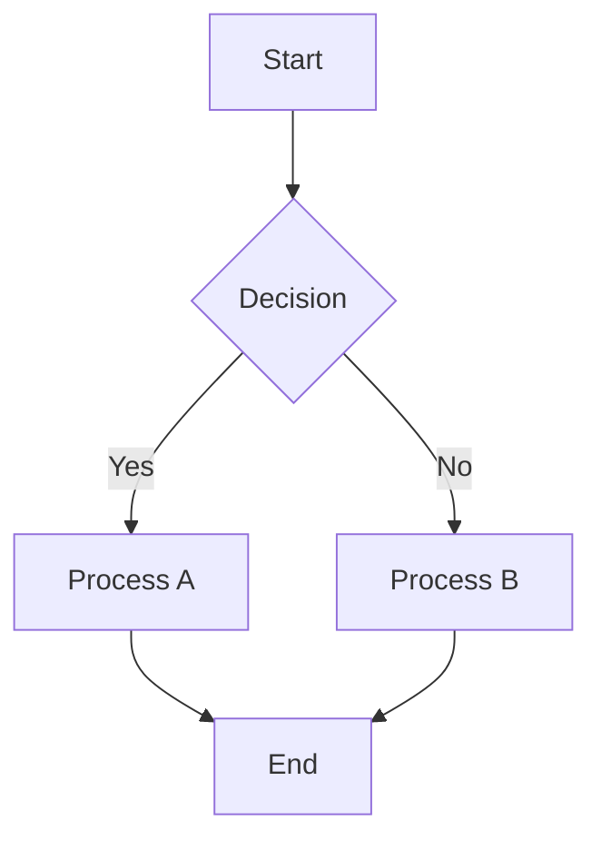

# Process Map Template

**Document Type:** Process Map  
**Process:** {{process_name}}  
**Version:** {{version}}  
**Classification:** {{classification}}

---

## 1. Process Overview

### 1.1 Purpose
What this process achieves and why it matters.

### 1.2 Scope
- **In Scope:** What is included
- **Out of Scope:** What is explicitly excluded

### 1.3 Stakeholders
| Role | Involvement |
|------|-------------|
| Role A | When and how involved |
| Role B | When and how involved |

---

## 2. Process Map (Text Description)

### 2.1 Visual Representation (Mermaid Syntax)

### 2.2 Step-by-Step Flow

| Step | Activity | Actor | Input | Output | Duration |
|------|----------|-------|-------|--------|----------|
| 1 | Activity description | Who does it | What they need | What they produce | How long |
| 2 | Activity description | Who does it | What they need | What they produce | How long |
| 3 | Activity description | Who does it | What they need | What they produce | How long |

---

## 3. Sub-Processes

### 3.1 Sub-Process A
**Triggered by:** What starts this sub-process

**Steps:**
1. Step one
2. Step two
3. Step three

**Completion criteria:** When is this sub-process done

---

### 3.2 Sub-Process B
[Repeat pattern for all sub-processes]

---

## 4. Decision Points

| ID | Decision | Criteria | True Path | False Path |
|----|----------|----------|-----------|------------|
| D1 | What is being decided | How to decide | If true, go to | If false, go to |
| D2 | What is being decided | How to decide | If true, go to | If false, go to |

---

## 5. Swimlane View

### Lane 1: [Actor/System A]
- Step they perform
- Step they perform

### Lane 2: [Actor/System B]
- Step they perform
- Step they perform

### Lane 3: [Actor/System C]
- Step they perform

---

## 6. Variations & Exceptions

### 6.1 Happy Path
Normal flow when everything goes as expected.

### 6.2 Exception Path A: [Scenario]
**Trigger:** What causes this path

**Flow:**
1. Different step 1
2. Different step 2
3. Merge back to main flow at step X

### 6.3 Exception Path B: [Scenario]
[Repeat pattern]

---

## 7. Metrics & KPIs

| Metric | Target | Measurement Method |
|--------|--------|-------------------|
| Metric A | Target value | How measured |
| Metric B | Target value | How measured |

---

## 8. Systems & Tools

| System/Tool | Purpose | Used In Step |
|-------------|---------|--------------|
| System A | What it's for | Steps X-Y |
| System B | What it's for | Steps Z |

---

## 9. Related Processes

- Upstream process: What feeds into this
- Downstream process: What this feeds into
- Related processes: Parallel or dependent processes

---

## 10. Risk & Control Points

| Risk | Control | Mitigation | Owner |
|------|---------|------------|-------|
| Risk description | Control in place | How it helps | Who owns it |

---

**Generated By:** Documentation Automation System  
**Source Documents:** {{source_list}}  
**Review Status:** {{review_status}}  
**Approval Required:** Yes  

---

**Note:** This is a fictional template for documentation automation training.
